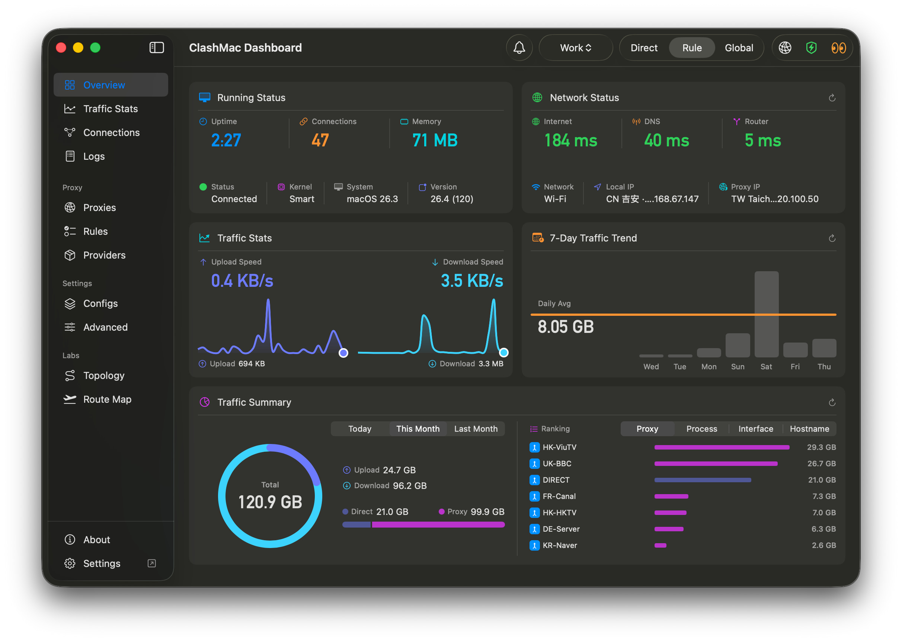
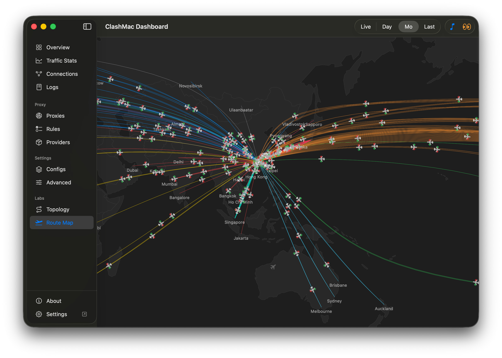
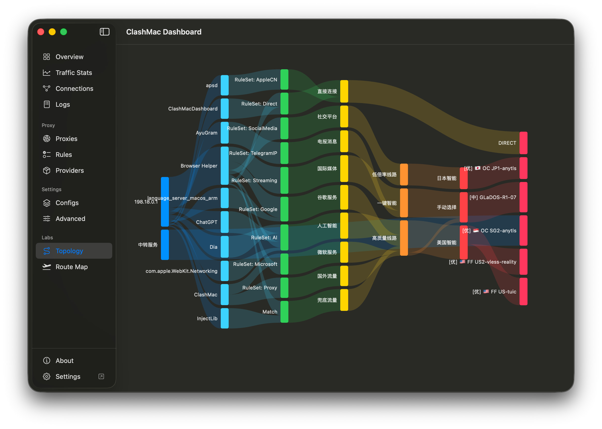

<div align="center">

[English](README.md) | [简体中文](README.zh-CN.md)

</div>


<p align="center">
  
</p>
<h1 align="center">ClashMac</h1>
<h3 align="center" style="margin-top: 0; margin-bottom: 10px;">Native Proxy Experience Built for macOS</h3>
<p align="center">
  🌐 <a href="https://clashmac.app"><strong>Official Website: clashmac.app</strong></a>
</p>

<p align="center" style="margin-top: 0; margin-bottom: 20px;">
  <a href="https://github.com/666OS/ClashMac/releases/latest">
    
  </a>
  <a href="https://github.com/666OS/ClashMac/releases">
    
  </a>
  <a href="https://clashmac.app">
    
  </a>
  <a href="https://t.me/Pinched666">
    
  </a>
</p>

<table>
  <tr>
    <td colspan="2" align="center"></td>
  </tr>
  <tr>
    <td colspan="2" align="center"></td>
  </tr> 
  <tr>
    <td colspan="2" align="center"></td>
  </tr>
  <tr>
    <td></td>
    <td></td>
  </tr>
</table>

## Core Experience

- **Route Map**: Take off from your city, arc across the globe, land at proxy nodes
  - Multi-hop Transit: dialer-proxy chain visualization, transit flights reach further
  - Live Flights: Every active connection is an airplane, flight status refreshes every 10s
  - Flight Log: Live / Today / This Month / Last Month, review every flight path
  - Global View: Scroll to zoom, drag to pan, double-click to return home
  - Smart Viewport: Auto-adjust view when switching time dimensions, all routes in sight
  - Continental Routes: Color-coded by destination continent, Asia/Europe/America routes at a glance
  - Night Lights: Routes glow like city lights in dark mode
  - Privacy Mode: 190+ cities as random departure points, only you know your location
  - Boarding Ritual: The world is vast, we need a small ceremony

- **Connection Topology**: Native traffic topology visualization, see where your data comes from and goes
  - Complete Chain: Source IP → Process → Rule → Proxy → Egress, fully transparent
  - Multi-layer Nesting: Supports nested subgroups, complex proxy structures clearly presented
  - Smart Highlight: Hover to illuminate upstream/downstream paths instantly
  - Hover Menu: Path hover shows statistics, popular domains aggregated

- **Traffic Statistics**: Native traffic statistics engine, track every byte precisely
  - 4D Tracking: Statistics by Proxy/Process/Interface/Host
  - Traffic Trends: 7-day bar chart with daily average, usage patterns at a glance
  - Subscription Usage: Traffic progress, expiry date at a glance
  - Rule Statistics: Visualize rule match counts, one-click reset

### Native Architecture
- **Native Built**: SwiftUI + macOS native APIs, deeply integrated with the system
- **Dual Proxy Modes**: System Proxy + TUN Enhanced, complete traffic coverage
- **Lightweight**: Menu bar resident, minimal memory footprint

### Visual Dashboard
- **Standalone Dashboard**: Native Dashboard app with Proxies/Rules/Connections/Logs at a glance
- **Privacy Mode**: One-click hide sensitive info like IP/nodes, share screenshots worry-free

### Proxy & Control
- **Real-Time Stats**: Menu bar shows speed, connections, memory usage
- **Quick Switch**: Switch nodes from menu bar/dashboard, one-click latency test
- **Auto-Disconnect**: Auto-disconnect existing connections on node switch, traffic flows through new node immediately
- **Global Hotkeys**: System-level shortcuts for proxy control, one-key dashboard access
- **One-Click Rules**: Add proxy rules for current webpage, supports major browsers

### Configuration
- **Zero Config**: Auto-complete DNS/TUN/GEO parameters, ready out of the box
- **Subscription Management**: Remote config import, auto-update, smart naming
- **Drag & Drop**: Drop YAML config, auto-switch and apply
- **Config Pre-Check**: Auto-validate before import, pinpoint errors precisely
- **Parameter Override**: Unified config across subscriptions, no file modification
- **Video Boost**: Disable overseas QUIC, say goodbye to YouTube buffering

### System & Experience
- **Crash Diagnosis**: Auto-identify issues, provide solutions
- **Customizable UI**: Show/hide menu items, create your own layout
- **Bilingual**: Auto-switch between English and Chinese
- **Password-Free**: Privileged helper handles auth, no password prompts

## System Requirements

**Minimum Version**: macOS 13.5+

> **macOS 12.x Users**: Please continue using [v1.4.24](https://github.com/666OS/ClashMac/releases/tag/v1.4.24), stable and reliable

## Download

Download the latest version from the [Releases page](https://github.com/666OS/ClashMac/releases/latest):

- **Apple Silicon (M1/M2/M3/M4)**: `ClashMac-v*-macos-arm64.zip`
- **Intel Mac**: `ClashMac-v*-macos-x86_64.zip`

**Compatible Configuration**: Please refer to [Test Configurations](https://github.com/666OS/YYDS/tree/main/mihomo/config)

**Installation Steps**:
1. Unzip the downloaded zip file
2. Drag `ClashMac.app` to the "Applications" folder
3. On first launch, right-click and select "Open" (to bypass security check)

**Tip**: Not sure which Mac you have? Click the  menu at the top left → About This Mac, and check the "Chip" information.

> **Note: Mac Gatekeeper may block unsigned applications**

### Solutions

#### Method 1: Allow in System Settings
1. Try to open ClashMac, click "Done" when the security warning appears
2. Open **System Settings** → **Privacy & Security**
3. Scroll down and find the message: "ClashMac was blocked from opening"
4. Click "Open Anyway" next to it
5. Click "Open Anyway" again in the popup dialog

#### Method 2: Remove Restrictions via Terminal
Enter in Terminal:

```bash
xattr -cr /Applications/ClashMac.app
```
Press Enter and reopen the application


#### Method 3: Remove Quarantine Attribute

Enter in Terminal:
```bash
xattr -d com.apple.quarantine /Applications/ClashMac.app
```
Press Enter and reopen the application

## Security Design

**Privileged Helper Security Hardening**: Fixed potential command injection vulnerabilities

- **Whitelist Path Validation**: Only allows kernel execution from `/Applications/ClashMac.app/`
- **Permission Tightening**: Restricted to admin user access only
- **POC Verified**: Attacks like `/bin/sh`, path traversal are all blocked

> *"Security is a process, not a product."* — Bruce Schneier

## Security & Privacy

This application runs entirely locally on macOS and does not collect or upload user data.  

Network access occurs only when explicitly configured by the user, or when the user manually checks for updates (downloads are served via GitHub).  

The application requests only the minimum system permissions required for its functionality.  

## License

ClashMac is a proprietary, closed-source application.  
Only binary releases are provided in this repository.

This project uses third-party open-source components.  
The full list of licenses is available at:

[THIRD_PARTY_LICENSES](https://github.com/666OS/ClashMac/blob/main/THIRD_PARTY_LICENSES.txt) 

## Acknowledgments

- [mihomo](https://github.com/MetaCubeX/mihomo)
- [Vernesong](https://github.com/vernesong/mihomo)
- [Zashboard](https://github.com/Zephyruso/zashboard)

## Star History
[](https://star-history.com/#666OS/ClashMac&Date)

---

<p align="center">
  Crafted with ❤️ for macOS
</p>
