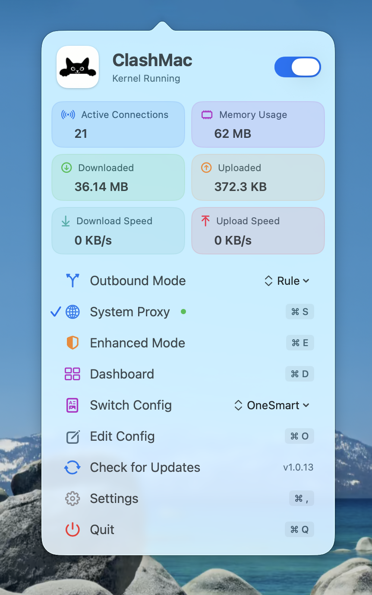

<div align="center">

**Languages:** [English](README.md) | [简体中文](README.zh-CN.md)

</div>

---

## ⚠️ Important Notice

The main project is currently not open source. This repository is primarily for publishing releases and collecting feedback.  
All third-party open-source components used in this application have their licenses publicly disclosed as required.

We will evaluate whether to open more content in the future based on project progress.  
Thank you for your understanding and support! For more details, please refer to the [Pinned Announcement](https://github.com/666OS/ClashMac/issues/15)

<br>
<p align="center">
  
</p>
<h1 align="center">ClashMac</h1>
<h3 align="center" style="margin-top: 0; margin-bottom: 20px;">Lightweight macOS Clash Menu Bar Client</h3>

<p align="center" style="margin-top: 0; margin-bottom: 50px;">
  <a href="https://github.com/666OS/ClashMac/releases/latest">
    
  </a>
  <a href="https://github.com/666OS/ClashMac/releases">
    
  </a>
</p>

<p align="center">
  
</p>

## Features

- **Native Application** - Built with SwiftUI, seamlessly integrated with the system
- **Lightweight & Efficient** - Menu bar app with minimal resource usage
- **Network Takeover** - One-click enable/disable system proxy & enhanced mode
- **Privileged Helper** - Password-free management of system proxy and kernel
- **Real-time Traffic Monitoring** - SSE push with millisecond-level updates
- **Visualization Panel** - Traffic statistics, connections count, memory usage
- **Web Dashboard** - Integrated control panel access
- **In-App Updates** - Auto-detect new versions with one-click download and installation

## Download

Download the latest version from the [Releases page](https://github.com/666OS/ClashMac/releases/latest):

- **Apple Silicon (M1/M2/M3/M4)**: `ClashMac-v*-macos-arm64.zip`
- **Intel Mac**: `ClashMac-v*-macos-x86_64.zip`

**Compatible Configuration**: Please refer to [Test Configurations](https://github.com/666OS/YYDS/tree/main/mihomo/config)

**Installation Steps**:
1. Unzip the downloaded zip file
2. Drag `ClashMac.app` to the "Applications" folder
3. On first launch, right-click and select "Open" (to bypass security check)

**Tip**: Not sure which Mac you have? Click the  menu at the top left → About This Mac, and check the "Chip" information.

> **Note: Mac Gatekeeper may block unsigned applications**  
> Since ClashMac is not Apple notarized, macOS will not allow it to open directly by default.

### Solutions

#### Method 1: Allow in System Settings
1. Try to open ClashMac, click "Done" when the security warning appears
2. Open **System Settings** → **Privacy & Security**
3. Scroll down and find the message: "ClashMac was blocked from opening"
4. Click "Open Anyway" next to it
5. Click "Open Anyway" again in the popup dialog

#### Method 2: Remove Restrictions via Terminal
Enter in Terminal:

```bash
xattr -cr /Applications/ClashMac.app
```
Press Enter and reopen the application


#### Method 3: Remove Quarantine Attribute

Enter in Terminal:
```bash
xattr -d com.apple.quarantine /Applications/ClashMac.app
```
Press Enter and reopen the application

## License

ClashMac is a proprietary, closed-source application.  
Only binary releases are provided in this repository.

This project uses third-party open-source components.  
The full list of licenses is available at:

[THIRD_PARTY_LICENSES](https://github.com/666OS/ClashMac/blob/main/THIRD_PARTY_LICENSES.txt) 

## Acknowledgments

- [mihomo](https://github.com/MetaCubeX/mihomo)
- [Vernesong](https://github.com/vernesong/mihomo)
- [Zashboard](https://github.com/Zephyruso/zashboard)

## Star History
[](https://star-history.com/#666OS/ClashMac&Date)

---

<p align="center">
  Made with ❤️ for macOS
</p>
